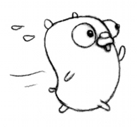

# webmedia-go

A Webmedia SDK for [Go](https://golang.org/).

# Usage

```go
package main

import (
    "log"

    "github.com/tpisani/webmedia-go"
)

func main() {
    c := webmedia.NewClient("access-token")

    tags, err := c.Tags().Name("Esporte").Fetch()
    if err != nil {
        log.Println("error while fetching tags:", err)
    } else {
        log.Println("tags:", tags)
    }

    videos, err := c.Videos().PerPage(5).AddTags("Futebol").Fetch()
    if err != nil {
        log.Println("error while fetching videos:", err)
    } else {
        log.Println("videos:", videos)
    }
}
```

### Using a custom fetcher

```go
package main

import (
    "http"
    "log"
    "net/url"

    "github.com/tpisani/webmedia-go"
)

type URLLogFetcher struct{}

func (f URLLogFetcher) FetchURL(u url.URL) (*http.Response, error) {
    log.Println("Fetching videos:", u.String())
    return http.Get(u.String())
}

func main() {
    c := webmedia.NewClient("access-token", webmedia.WithURLFetcher(URLLogFetcher{}))

    videos, err := c.Videos().PerPage(10).Fetch()
    if err != nil {
        log.Println("error while fetching videos:", err)
    } else {
        log.Println("videos:", videos)
    }
}
```

# How to contribute

- Fork.

- Write code with tests.

- Make a pull request!
